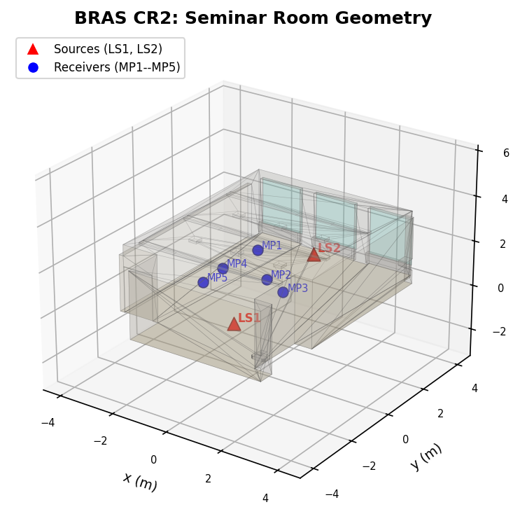
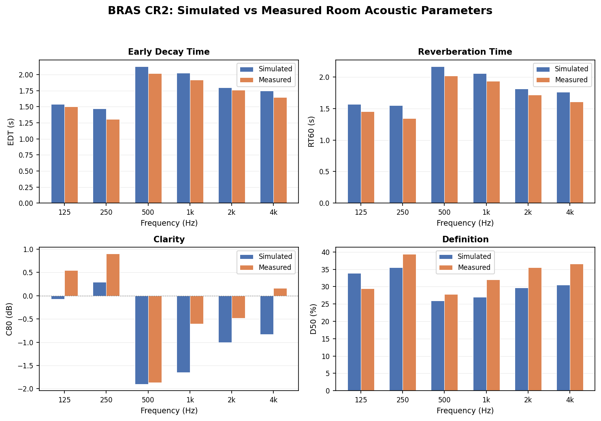

# BRAS CR2 Benchmark: Small Seminar Room

## Background

Validating a room acoustics simulator requires comparing its predictions against
real-world measurements taken in well-characterized rooms. The **BRAS (Benchmark
for Room Acoustical Simulation)** database [1] was created for exactly this
purpose. It provides detailed 3D geometry, calibrated material data, and in-situ
acoustic measurements for a set of rooms, enabling reproducible comparison across
different simulation tools.

The BRAS database covers rooms ranging from small seminar rooms to large concert
halls. For each room, it includes:

- 3D geometry models (AC3D format) with per-surface material assignments
- Frequency-dependent absorption and scattering coefficients (fitted estimates
  from measurements, 31 third-octave bands from 20 Hz to 20 kHz)
- Source and receiver positions matching the measurement setup
- Measured room impulse responses and derived acoustic parameters (EDT, RT60,
  C80, D50) for all source-receiver pairs

The geometry files and simulation input data used in this benchmark come from
a supplementary dataset by Aspoeck [2], which provides simulation input files
for RAVEN -- a room acoustic simulation software developed at RWTH Aachen
University that combines image source and ray tracing methods [2]. The dataset
includes RAVEN project files (`.rpf`), AC3D geometry, and source/receiver
positions for all BRAS scenes.

This benchmark validates building3d-rs against the **CR2** case (Scene 09), a
small seminar room.



## Case Description

**Scene**: CR2 (Scene 09) -- Small seminar room at RWTH Aachen University [1]

| Property           | Value                                      |
|--------------------|--------------------------------------------|
| Room type          | Seminar room (roughly rectangular)         |
| Dimensions         | ~8.4 m x 6.7 m x 3.0 m                     |
| Volume             | 146.1 m^3 (from 3D model)                  |
| Surface area       | 202.5 m^2                                  |
| Temperature        | 19.5 C                                     |
| Relative humidity  | 41.7%                                      |
| Number of surfaces | 5 material groups, 330 polygons            |

## Source and Receiver Positions

Two loudspeaker sources (LS1, LS2) and five microphone receivers (MP1--MP5),
matching the BRAS measurement setup [1]. Coordinates below are in building3d
z-up convention, converted from the RAVEN y-up system [2] via
(x, y_up, z_raven) -> (x, -z_raven, y_up).

| Position | x (m)  | y (m)   | z (m)  |
|----------|--------|---------|--------|
| LS1      |  0.931 | -2.547  | 0.723  |
| LS2      |  0.119 |  2.880  | 0.723  |
| MP1      | -0.993 |  1.426  | 1.230  |
| MP2      |  0.439 | -0.147  | 1.230  |
| MP3      |  1.361 | -0.603  | 1.230  |
| MP4      | -1.110 | -0.256  | 1.230  |
| MP5      | -0.998 | -1.409  | 1.230  |

## Materials

Frequency-dependent absorption and scattering coefficients from BRAS fitted
estimates [1] (31 third-octave bands, subsampled to 6 octave bands).

### Absorption coefficients

| Material | Area (m^2) | 125 Hz | 250 Hz | 500 Hz | 1000 Hz | 2000 Hz | 4000 Hz |
|----------|------------|--------|--------|--------|---------|---------|---------|
| concrete | 56.94      | 0.085  | 0.075  | 0.056  | 0.059   | 0.059   | 0.044   |
| windows  |  9.75      | 0.175  | 0.073  | 0.049  | 0.057   | 0.133   | 0.055   |
| ceiling  | 51.62      | 0.083  | 0.104  | 0.048  | 0.049   | 0.047   | 0.062   |
| plaster  | 34.93      | 0.033  | 0.050  | 0.039  | 0.044   | 0.048   | 0.036   |
| floor    | 49.29      | 0.071  | 0.091  | 0.070  | 0.065   | 0.062   | 0.043   |

### Scattering coefficients

Estimated from characteristic depth via s(f) = 0.5 * sqrt(d_char / (c/f)),
clamped to [0.05, 0.99]. Frequency-dependent values are read from the BRAS
CSV files at runtime.

## Simulation Parameters

| Parameter                | Value                                  |
|--------------------------|----------------------------------------|
| Acoustic mode            | Frequency-dependent (6 octave bands)   |
| Number of rays           | 50,000                                 |
| Time step (dt)           | 25 us                                  |
| Maximum simulation time  | 3.0 s                                  |
| Number of steps          | 120,000                                |
| Receiver radius          | 0.8 m (spherical absorbers)            |
| Receiver time resolution | 2 ms (histogram bin width)             |
| Reflection model         | Hybrid (specular + diffuse scattering) |
| Air absorption           | ISO 9613-1 [3] (20 C, 50% RH)          |
| Early termination        | < 1% rays alive                        |

### Comparison with RAVEN reference settings [2]

| Parameter          | building3d        | RAVEN                       |
|--------------------|-------------------|-----------------------------|
| Ray count          | 50,000            | 500,000                     |
| Filter length      | 3.0 s             | 2.8 s                       |
| Detection sphere   | 0.8 m             | 0.8 m                       |
| Time resolution    | 2 ms              | 2 ms                        |
| Image sources      | none              | order 2                     |
| Band resolution    | octave            | third-octave                |
| Air absorption     | ISO 9613-1        | ISO 9613-1 (T=19.5, RH=41.7)|

## Room Acoustic Metrics

All metrics are derived from the room impulse response (IR) between a source
and receiver, following ISO 3382-1 [4]. They are computed per octave band from
the Schroeder backward-integrated energy decay curve.

- **EDT (Early Decay Time)**: A line is fit to the Schroeder decay curve over
  the first 10 dB of decay (0 to -10 dB), then extrapolated to 60 dB. EDT
  correlates with the *perceived* reverberance of a room because human hearing
  is most sensitive to the early part of the decay.

- **RT60 (Reverberation Time)**: The time for sound energy to decay by 60 dB.
  Because measuring a full 60 dB decay requires very high signal-to-noise
  ratios, RT60 is usually estimated from a smaller range: T20 fits the decay
  from -5 to -25 dB and extrapolates to 60 dB; T30 uses -5 to -35 dB. RT60
  is the most widely used metric for characterizing room acoustics.

- **C80 (Clarity)**: The ratio of early sound energy (first 80 ms) to late
  energy (after 80 ms), expressed in decibels:
  C80 = 10 * log10(E_0-80ms / E_80ms-inf). Positive values indicate good
  clarity (important for music perception). Typical concert halls range from
  -2 to +4 dB.

- **D50 (Definition)**: The fraction of sound energy arriving within the first
  50 ms relative to total energy: D50 = E_0-50ms / E_total. Higher values
  indicate better speech intelligibility. Values above 50% are considered good
  for speech; rooms used for music typically have lower D50.

## Results



Simulated room acoustic parameters averaged across all 10 source-receiver
pairs (2 sources x 5 receivers), compared against BRAS in-situ measurements.

Results below obtained with 5,000 rays (for faster execution). Running the
benchmark writes `results.csv` which can be used to regenerate the charts via
`python3 examples/bras_cr2/generate_figures.py`. Increasing to 50,000 rays
reduces statistical noise but does not substantially change the averaged metrics.

### EDT (Early Decay Time)

| Freq (Hz) | Simulated (s) | Measured (s) | Error (%) |
|-----------|---------------|--------------|-----------|
| 125       | 1.55          | 1.50         | +3.4      |
| 250       | 1.48          | 1.31         | +13.4     |
| 500       | 2.13          | 2.02         | +5.8      |
| 1000      | 2.03          | 1.92         | +6.0      |
| 2000      | 1.81          | 1.76         | +2.9      |
| 4000      | 1.76          | 1.65         | +6.5      |

### RT60 (Reverberation Time)

Simulated values use T30 with T20 fallback (Schroeder backward integration).

| Freq (Hz) | Simulated (s) | Measured T20 (s) | Error (%) |
|-----------|---------------|------------------|-----------|
| 125       | 1.58          | 1.45             | +8.5      |
| 250       | 1.55          | 1.35             | +15.3     |
| 500       | 2.16          | 2.02             | +6.8      |
| 1000      | 2.05          | 1.93             | +5.9      |
| 2000      | 1.81          | 1.72             | +5.7      |
| 4000      | 1.76          | 1.60             | +9.9      |

### C80 (Clarity)

| Freq (Hz) | Simulated (dB) | Measured (dB) | Error (dB) |
|-----------|----------------|---------------|------------|
| 125       | -0.08          | +0.55         | -0.6       |
| 250       | +0.27          | +0.90         | -0.6       |
| 500       | -1.93          | -1.86         | -0.1       |
| 1000      | -1.67          | -0.61         | -1.1       |
| 2000      | -1.02          | -0.48         | -0.5       |
| 4000      | -0.84          | +0.16         | -1.0       |

### D50 (Definition)

| Freq (Hz) | Simulated (%) | Measured (%) | Error (pp) |
|-----------|---------------|--------------|------------|
| 125       | 34.0          | 29.5         | +4.5       |
| 250       | 35.7          | 39.4         | -3.7       |
| 500       | 26.0          | 27.8         | -1.8       |
| 1000      | 27.1          | 32.1         | -5.0       |
| 2000      | 29.8          | 35.6         | -5.8       |
| 4000      | 30.6          | 36.6         | -6.0       |

### Summary

| Metric | Frequency range | Typical error         |
|--------|-----------------|-----------------------|
| EDT    | 125--4000 Hz    | +3% to +13%           |
| RT60   | 125--4000 Hz    | +6% to +15%           |
| C80    | 125--4000 Hz    | -0.1 to -1.1 dB       |
| D50    | 125--4000 Hz    | -6.0 to +4.5 pp       |

EDT and RT60 show a systematic positive bias of 3--15%, meaning the simulation
slightly overestimates reverberation. This is consistent with the absence of
image sources (which capture early specular reflections more accurately) and
the use of octave-band rather than third-octave-band resolution.

C80 is systematically negative (simulation predicts less early energy relative
to late energy), which is consistent with the RT overestimation.

D50 errors are within 6 percentage points, which is acceptable for geometric
acoustics at these frequencies.

## Running the Benchmark

```bash
cargo run --example bras_cr2 --release
```

The simulation requires the BRAS validation data in `validation/bras/`. This
data is not distributed with building3d-rs; see the Data Sources section below
for download instructions.

**Runtime**: With 50,000 rays and 120,000 steps, each source takes
approximately 15--30 minutes on a modern multi-core CPU (ray propagation is
parallelized with rayon). Total benchmark time is ~30--60 minutes for both
sources. Reduce `num_rays` to 5,000 for a quick test (~2 minutes per source).

## Known Limitations

- **No image sources**: building3d-rs uses stochastic ray tracing only. The
  image source method mirrors the sound source across wall surfaces to find
  exact specular reflection paths deterministically. Professional tools like
  RAVEN combine image sources (for the first 2--3 reflection orders) with ray
  tracing (for late reverberation). Without image sources, early reflections
  are noisier and slightly less accurate, which contributes to the C80/D50
  bias observed in the results.
- **Octave-band resolution**: The simulation uses 6 octave bands (125--4000 Hz)
  while BRAS measurements are in third-octave bands. The measured values shown
  above are the octave-band equivalents.
- **Geometry simplification**: 4 ceiling polygons are skipped due to degenerate
  normals, which slightly alters the ceiling geometry.
- **Air absorption**: Uses ISO 9613-1 [3] standard conditions (20 C, 50% RH)
  rather than the actual room conditions (19.5 C, 41.7% RH). The difference
  is small but contributes to the systematic bias.
- **Absorber model**: Receivers are modeled as transparent spherical absorbers
  that record energy on ray entry without removing the ray. This avoids energy
  starvation but means the same ray can be counted by multiple receivers.

## Data Sources

### BRAS Database [1] (CC BY-SA 4.0)

> Brinkmann, F., Aspoeck, L., Ackermann, D., Opdam, R., Vorlaender, M., &
> Weinzierl, S. (2021). "A benchmark for room acoustical simulation. Concept
> and database." *Applied Acoustics*, 176, 107867.
> https://doi.org/10.1016/j.apacoust.2020.107867

- **Download**: https://depositonce.tu-berlin.de/items/38410727-febb-4769-8002-9c710ba393c4
- **DOI**: 10.14279/depositonce-6726.3
- **License**: CC BY-SA 4.0

### Informed Simulation Data [2] (CC BY-NC-SA 4.0)

> Aspoeck, L. (2020). "Input and output data for informed room acoustic
> simulations of the BRAS scene database." RWTH Aachen University.

- **Download**: https://publications.rwth-aachen.de/record/803828
- **License**: CC BY-NC-SA 4.0

This supplementary dataset provides the AC3D geometry files (`scene9.ac`) and
RAVEN simulation input files (`.rpf`) with source/receiver positions used by
this benchmark.

### Required Files

After downloading, place the files so the following paths exist:

```
validation/bras/
  informed_sim/
    RavenModels/
      scene9.ac                              # CR2 room geometry (AC3D)
  surface_descriptions/
    3 Surface descriptions/
      _csv/
        fitted_estimates/
          mat_CR2_concrete.csv               # Material absorption/scattering
          mat_CR2_windows.csv
          mat_CR2_ceiling.csv
          mat_CR2_plaster.csv
          mat_CR2_floor.csv
```

## References

1. Brinkmann, F., Aspoeck, L., Ackermann, D., Opdam, R., Vorlaender, M., &
   Weinzierl, S. (2021). A benchmark for room acoustical simulation. Concept
   and database. *Applied Acoustics*, 176, 107867.
   https://doi.org/10.1016/j.apacoust.2020.107867

2. Aspoeck, L. (2020). Validation of room acoustic simulation models.
   PhD thesis, RWTH Aachen University.

3. ISO 9613-1:1993. Acoustics -- Attenuation of sound during propagation
   outdoors -- Part 1: Calculation of the absorption of sound by the
   atmosphere.

4. ISO 3382-1:2009. Acoustics -- Measurement of room acoustic parameters --
   Part 1: Performance spaces.
